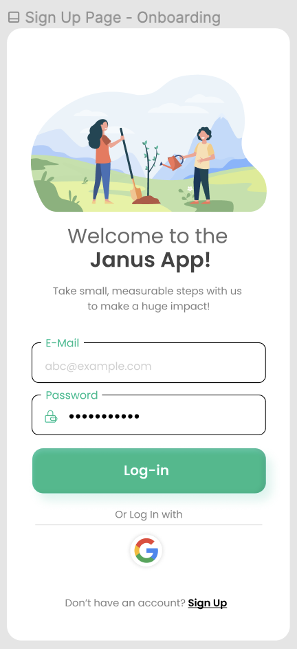
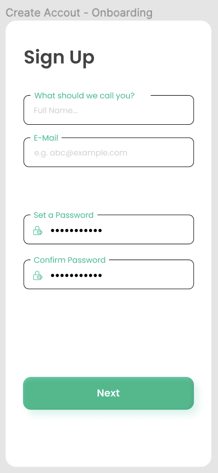
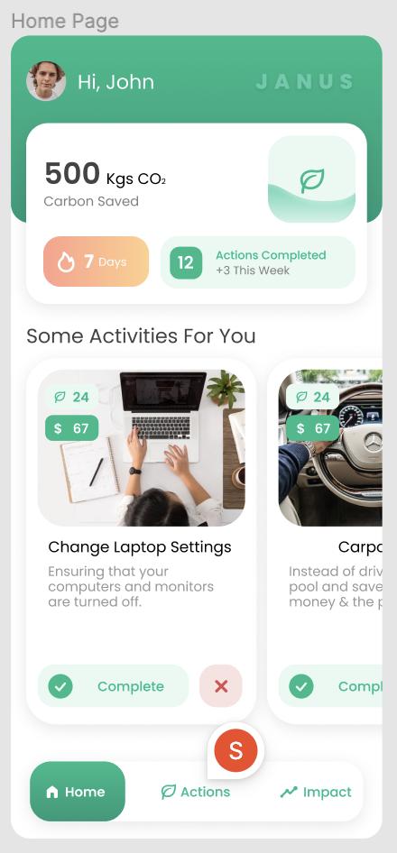
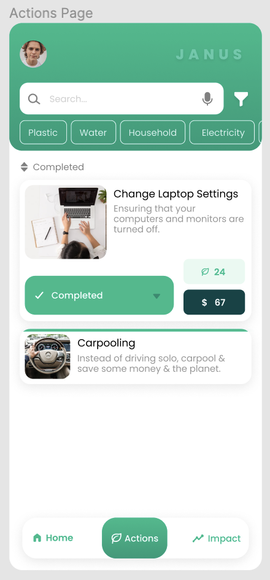
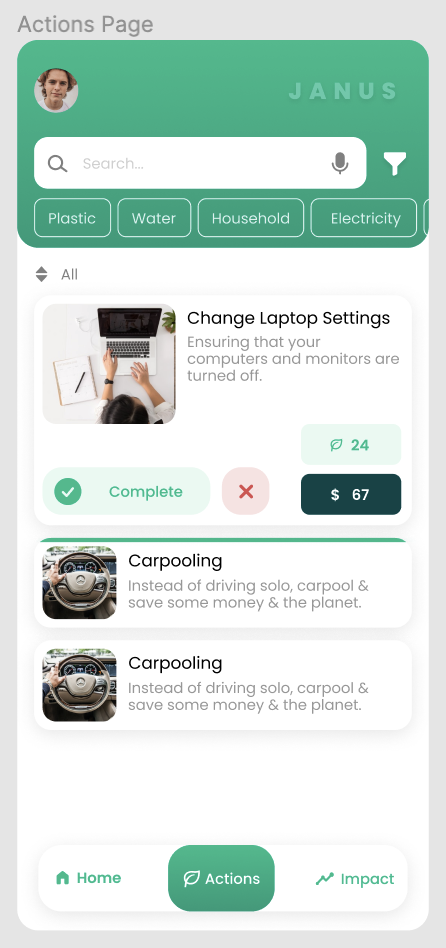
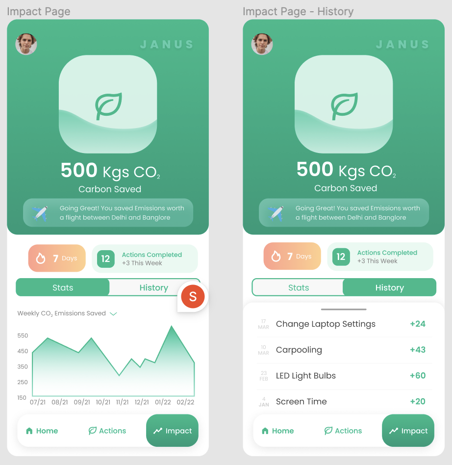

# Climate Ark App
### **Overview**
- Uchicago TechTeam Project to build an app to enable users to drive and measure climate positive actions
- Method: Mobile Application
- Objective (based on impact assessment and user needs):
    - Provide crisp and verified news on climate change
    - Enable carbon footprint calculation
- Technical Stack
    - Application Development: Flutter and Firebase
    - Database: Google’s Firestore for authentication and storage 

## Sign Up & Create Account Page

  
  
  

## Home, Actions, Impact Page
- **Home**: Gives a curated list of actions in the form of cards according to the user’s inputs from the onboard page.
- **Actions**: List of actions to complete that tap-expand into detailed cards, keep track of personal records of energy saving actions.
- **Impact**: Show the footprint offsetted and a comparative measure of it. Record number of activities completed, streak days, carbon offsetted.

  
  
  

  

