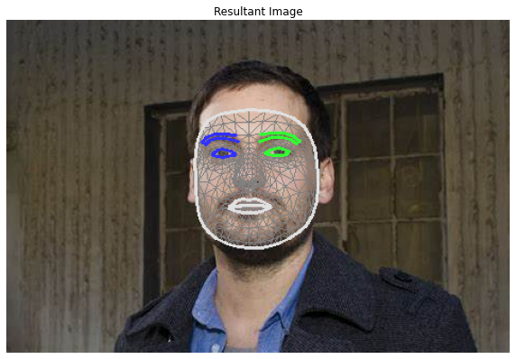
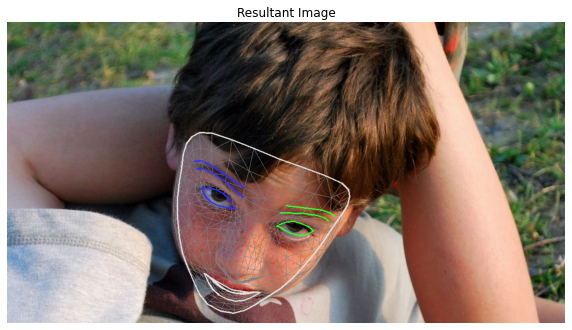
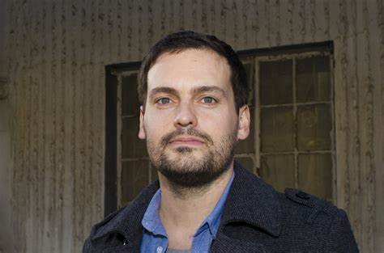

# Face Detection & Alignment
### **1. Face Detection**
- Compare 3 different face detection models and evaluate/compare their performances
  - Haar Cascade Face recognition (OpenCV)
  - Frontal face detector (OpenCV)
  - Face Mesh Model (Mediapipe)

  
   

### **2. Face Alignment**
- Using Face Mesh Model, extract right & left eye position
- Compute the angle between two eye position
- Rotate the original image correspondingly

## Sample Input & Sample Output

  
   

  
   

