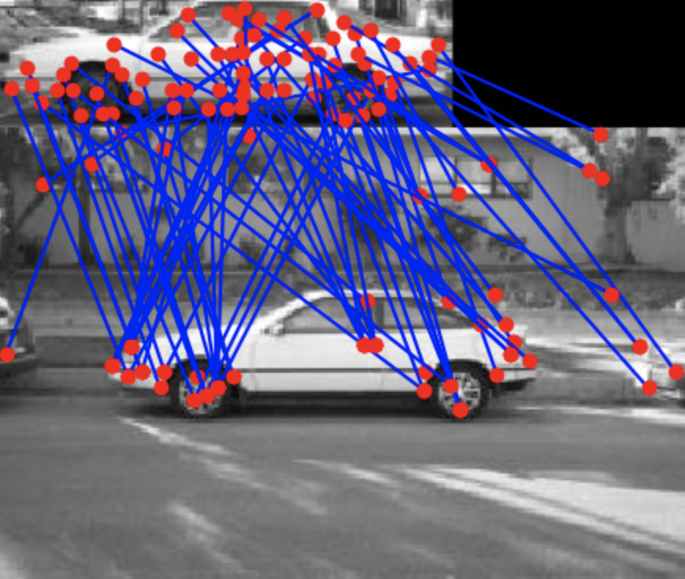
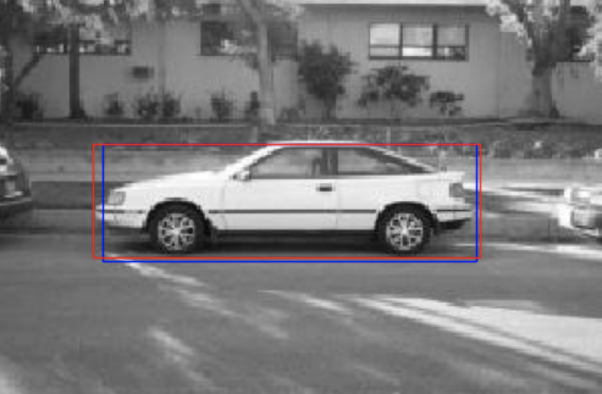
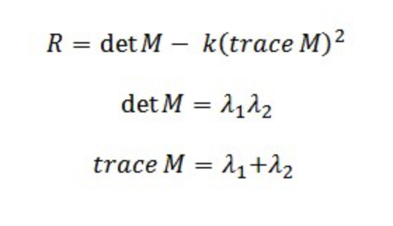
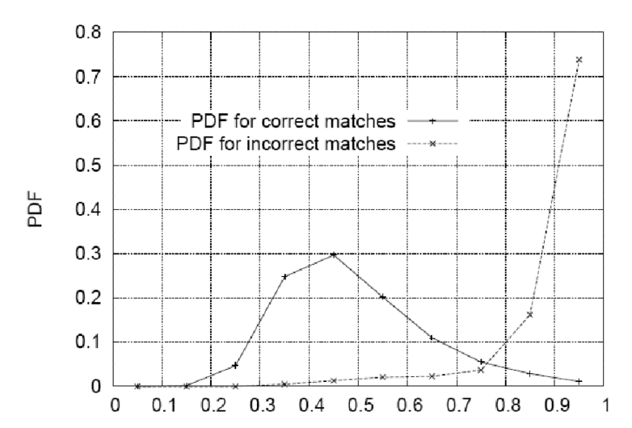

# Object Detection: Interest Points and Feature Descriptors

Design and implement interest point detection, feature descriptor extraction, feature matching, and apply those functions to the task of object detection. 
After matching descriptors between a template image of an object and a test image containing an example of the same object category, the code predicts the location (bounding box) of the object in the test image.

## Sample Outputs

  

  

## Functions & Design Choices

- **Harris Corner Detector**
  1. Apply Gaussian Filter
  2. Apply Sobel Gradients
  3. For each pixel, consider a (4*scale+1)×(4*scale+1) window to compute Harris cornerness value 
  4. For each pixel, apply nonmaximum suppression over (2*scale+1) ×(2*scale+1) window 
  5. Select the highest 2% of points for maximum threshold 

  The Harris Corner Value, R, could be computed as following
  

    
  

  
  
- **Feature Descriptor**
  1. Implement a SIFT-like feature descriptor by binning orientation energy in spatial cells surrounding an interest point
  2. 3 x 3 spatial grid consisting of cell of a set width (see below) surrounding an interest point, marked
   by () in the diagram below.  Using 8 orientation bins, spaced evenly in [pi,-pi] yields a feature vector with 3 * 3 * 8 = 72 dimensions. 
  3. Each grid with width = 3, Total dimension 27x27
  
- **Feature Matching**
  1. Compute the Euclidean distance of the direction magnitude for every interest point of the test image. 
  2. The score of each match is computed by d1/d2 (d1: closest distance, d2: 2nd closest distance)
   
- **Hough Transform**
  1. For each match of interest points, compute the difference in co-ordinates. ty=y1-y0, tx=x1-x0.
  2. Compute the weight(pdf for correct matches – pdf for incorrect matches) of (ty, tx) based on the probability distribution function below:

  

- **Object Detection**
  1. Multiply each template images with its template masks 
  2. Find interest points of template & test images 
  3. Find feature extractors for each interest points found in (2) 
  4. Match features 
  5. Repeat the process n times for n number of template images and average the output ty and tx value to compute the co-ordinate.  
  6. Implement a single scale and multi-scale strategy: Implement multi-scale interest points and feature descriptors 
